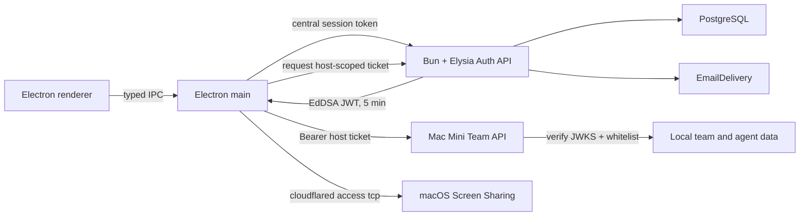

# Plan 001: Dodaj centralne API kont i whitelistę hosta

> [!IMPORTANT]
> Część backendowa tego planu jest nieaktualna. Plan
> `002-tanstack-solid-cloudflare-d1-auth.md` zastępuje Bun + Elysia, PostgreSQL
> oraz lokalne hasła przez TanStack Start, Solid 2, Cloudflare Workers, D1 i
> jednorazowe kody email. Pozostałe wymagania dla whitelisty hosta nadal są
> aktualne, ale muszą używać nowego API kont.

> **Instrukcja dla wykonawcy**: Wykonaj ten plan krok po kroku. Po każdym kroku
> uruchom podane polecenie i potwierdź oczekiwany wynik. Jeżeli wystąpi warunek
> z sekcji `STOP`, przerwij pracę i zgłoś problem. Nie zgaduj. Po zakończeniu
> ustaw stan tego planu na `DONE` w `plans/README.md`, chyba że reviewer prowadzi
> indeks samodzielnie.
>
> **Sprawdzenie zmian repozytorium — wykonaj najpierw**:
>
> ```bash
> git diff --stat 8229759..HEAD -- package.json bun.lock README.md CONTRIBUTING.md electron-builder.yml .github apps src/main src/preload src/renderer packages/contracts/src
> git status --short
> ```
>
> Plan powstał na commicie `8229759`, ale drzewo robocze było brudne. Pliki
> `src/main/host-service.ts`, `src/main/remote-server-manager.ts`,
> `src/main/team-api-server.ts`, `src/main/team-store.ts` i nowe komponenty UI
> były niezacommitowane. Sam `git diff 8229759..HEAD` nie wykryje zmian w tych
> plikach. Porównaj też sekcję „Stan obecny” z żywym kodem. Jeżeli kontrakty lub
> przepływ autoryzacji różnią się od opisu, użyj warunku `STOP`.

## Status

- **Priorytet**: P1
- **Rozmiar**: L
- **Ryzyko**: HIGH
- **Zależności**: brak
- **Kategoria**: direction, security, migration
- **Zaplanowano przy**: commit `8229759`, 2026-08-18

## Dlaczego to jest potrzebne

Obecny prototyp tworzy konta, hasła i sesje osobno na każdym hoście. Klient
wysyła hasło bezpośrednio do hosta. Ten model nie zapewnia jednego konta
OpenBot i zmusza każdy Mac Mini do obsługi danych logowania.

Po tej zmianie oddzielny serwer Bun + Elysia będzie właścicielem rejestracji,
unikalnego emaila, hasła i sesji. Host będzie przechowywał tylko lokalną
whitelistę i rolę dla danego teamu. Klient zaloguje się raz do centralnego API,
a host przyjmie krótki token podpisany przez centralne API tylko wtedy, gdy
zweryfikowany użytkownik znajduje się na jego whiteliście.

## Docelowa architektura



Granice odpowiedzialności:

- Centralne API zapisuje: email, skrót hasła, weryfikację emaila, centralne
  sesje i tokeny odzyskania konta.
- Host zapisuje: `serverId`, `email`, stały `userId`, rolę, stan blokady oraz
  dane teamu i agentów. Host nie zapisuje hasła, skrótu hasła, salta,
  nickname'u ani centralnego tokenu sesji.
- Klient zapisuje centralny token sesji wyłącznie przez Electron `safeStorage`.
  Klient nie zapisuje hasła. Krótki token hosta pozostaje tylko w pamięci.
- Tożsamość Ed25519 hosta, która podpisuje zmianę adresu Quick Tunnel, pozostaje
  niezależna od klucza Ed25519 centralnego API.
- Cloudflare Tunnel i VNC nie zmieniają protokołu. Ten plan zmienia tylko
  autoryzację API teamu.

## Decyzje, których nie wolno zmienić podczas wykonania

### Tożsamość użytkownika

Produkt pokazuje i wyszukuje użytkownika przez unikalny, zweryfikowany email.
Token musi jednak mieć niezmienny UUID w claimie `sub`. Email może się zmienić
lub zostać ponownie użyty. Dlatego wpis whitelisty ma ten kształt:

```ts
interface HostWhitelistMember {
  id: string;
  userId: string | null;
  email: string;
  role: "owner" | "admin" | "member";
  disabled: boolean;
  createdAt: string;
  updatedAt: string;
}
```

Host pozwala dodać oczekujący email, zanim konto powstanie. Przy pierwszym
poprawnym połączeniu host atomowo ustawia `userId` z `sub`. Później wymaga
zgodności `userId` i emaila. Nie zmienia powiązania automatycznie.

Normalizacja emaila: usuń białe znaki na początku i końcu, a następnie zmień
litery ASCII na małe. Nie usuwaj kropek ani części `+tag`. Reguły dostawców
poczty nie są regułami tożsamości OpenBot. W pierwszej wersji akceptuj tylko
adresy ASCII o długości do 254 znaków. Hasło ma od 12 do 128 znaków. Nie
obcinaj hasła i nie zmieniaj jego wielkości liter.

### Uwierzytelnienie centralne

- Rejestracja wymaga weryfikacji emaila przed wydaniem tokenu hosta. Bez tego
  atakujący mógłby przejąć oczekujący wpis whitelisty.
- Hasło zapisuj przez asynchroniczne
  `Bun.password.hash(password, { algorithm: "argon2id" })`. Bun tworzy sól
  automatycznie. Sprawdzaj przez `Bun.password.verify`.
- Centralna sesja ma losowy token 256-bit. W PostgreSQL zapisuj tylko SHA-256
  tokenu. Domyślny czas ważności: 30 dni.
- Odpowiedzi logowania i odzyskania hasła nie mogą ujawniać, czy email istnieje.
- Ogranicz liczbę prób rejestracji, logowania, weryfikacji emaila, resetu hasła
  i wydawania tokenów hosta.

Oficjalne API Bun dla haszy haseł opisuje Argon2 i automatyczną sól:
[Bun password hashing](https://bun.sh/docs/runtime/hashing). PostgreSQL należy
obsłużyć przez natywne tagowane zapytania i transakcje Bun:
[Bun SQL](https://bun.sh/docs/runtime/sql).

### Token hosta

Endpoint `POST /v1/host-tickets` wydaje token EdDSA ważny maksymalnie 5 minut.
Użyj `@elysia/jwt`. Token i nagłówek muszą zawierać:

```ts
interface HostTicketClaims {
  iss: "https://<production-auth-origin>";
  aud: `urn:openbot:host:${string}`;
  sub: string; // immutable central user UUID
  email: string; // normalized and verified
  email_verified: true;
  sid: string; // central session id
  jti: string;
  iat: number;
  nbf: number;
  exp: number;
  typ: "openbot-host-access-v1";
}
```

Nagłówek JWT ma `alg: "EdDSA"` i `kid`. Host sprawdza dokładny `issuer`,
`audience`, `typ`, `email_verified`, czas oraz podpis. Host nie przyjmuje
`issuer`, JWKS URL ani klucza z linku zaproszenia. Te wartości pochodzą z
zaufanej konfiguracji aplikacji. Przy nieznanym `kid` host odświeża JWKS jeden
raz. JWKS zawiera klucz bieżący i poprzedni podczas rotacji.

Oficjalny plugin Elysia obsługuje EdDSA oraz standardowe claims:
[Elysia JWT](https://elysiajs.com/plugins/jwt).

### Whitelistowanie zamiast lokalnych zaproszeń

- Owner i admin dodają `email + role` do whitelisty hosta.
- Centralne API nie ma endpointu „czy ten email ma konto”. Taki endpoint
  ujawniałby rejestrację użytkowników.
- Link serwera zawiera tylko `apiUrl`, `serverId`, fingerprint i publiczny klucz
  hosta. Link nie zawiera sekretu ani danych konta.
- Sam link nie daje dostępu. Klient musi mieć centralną sesję, zweryfikowany
  email i wpis na whiteliście.
- Usuń lokalne endpointy hosta `/v1/join`, `/v1/auth/login` i
  `/v1/auth/password`. Host nie tworzy lokalnej sesji użytkownika.
- Host może nadal mieć endpoint `/v1/auth/me`, ale zwraca on tożsamość z
  poprawnego tokenu hosta i lokalną rolę. Nie tworzy sesji.

## Stan obecny

Repozytorium jest aplikacją Electron. Proces `main` uruchamia procesy lokalne,
API hosta i `vnc://`. Renderer używa SolidJS. Pakiety instaluje Bun 1.3.11.
Pełna kontrola jakości to `bun run check`.

Istotne pliki i istniejący problem:

- `src/main/team-store.ts:23-26` rozszerza członka o `passwordSalt` i
  `passwordHash`.
- `src/main/team-store.ts:130-161` konfiguruje host z lokalnym ownerem,
  username'em i hasłem.
- `src/main/team-store.ts:207-305` tworzy lokalne zaproszenia, przyjmuje hasło,
  loguje i zmienia hasło.
- `src/main/team-api-server.ts:82-132` udostępnia `/v1/join`,
  `/v1/auth/login`, logout i zmianę lokalnego hasła.
- `src/main/remote-server-manager.ts:105-172` przesyła username i password do
  hosta, a potem zapisuje zaszyfrowany token hosta.
- `packages/contracts/src/ipc.ts:85-116` ma `JoinServerInput`, `LoginServerInput` i
  `ConfigureHostInput` z polami username/password.
- `src/renderer/src/components/HostPanel.tsx:75-123` prosi o lokalne dane ownera.
- `src/renderer/src/components/JoinServerDialog.tsx:3-73` prosi o username i
  password hosta.
- `README.md` deklaruje brak backendu OpenBot i brak systemu kont. Po wdrożeniu
  ta deklaracja będzie nieprawdziwa.

Obecny kształt, który ma zniknąć:

```ts
// src/main/team-store.ts:23-26
interface StoredMember extends TeamMemberSummary {
  passwordSalt: string;
  passwordHash: string;
}

// packages/contracts/src/ipc.ts:85-116, skrót
interface JoinServerInput { inviteUrl: string; username: string; password: string }
interface LoginServerInput { serverId: string; username: string; password: string }
interface ConfigureHostInput { serverName: string; username: string; password: string }
```

Repozytorium używa TypeScript, jawnych kontraktów IPC w `packages/contracts/src/ipc.ts`,
testów Vitest obok modułów i `shell: false` dla procesów potomnych. Zachowaj te
konwencje. Walidację Elysia zbuduj przez `t.Object` z jawnie opisanymi body,
params, headers i response. Nie stosuj niezwalidowanych `unknown` na granicy
HTTP. Zobacz [Elysia validation](https://elysiajs.com/tutorial/getting-started/validation/).

## Kontrakt centralnego API

Wszystkie odpowiedzi błędu mają stabilny kształt:

```ts
interface ApiErrorResponse {
  error: {
    code: string;
    message: string;
    requestId: string;
  };
}
```

Minimalne endpointy:

| Metoda i ścieżka | Auth | Wejście | Wynik |
|---|---|---|---|
| `POST /v1/auth/register` | brak | `{email,password}` | `202`; ogólny komunikat |
| `POST /v1/auth/verify-email` | brak | `{token}` | `204` |
| `POST /v1/auth/login` | brak | `{email,password}` | centralny session token + user |
| `POST /v1/auth/logout` | sesja | brak | `204`; revokacja bieżącej sesji |
| `GET /v1/auth/sessions` | sesja | brak | aktywne sesje użytkownika |
| `DELETE /v1/auth/sessions/:id` | sesja | path id | `204`; revokacja wskazanej sesji |
| `POST /v1/auth/password/forgot` | brak | `{email}` | `202`; ogólny komunikat |
| `POST /v1/auth/password/reset` | brak | `{token,password}` | `204`; revokacja wszystkich sesji |
| `GET /v1/me` | sesja | brak | `CentralUserSummary` |
| `POST /v1/host-tickets` | sesja | `{hostId}` | `{token,expiresAt}` |
| `GET /.well-known/jwks.json` | brak | brak | publiczne JWK, bez private key |
| `GET /health/live` | brak | brak | proces działa |
| `GET /health/ready` | brak | brak | DB i klucz gotowe |

Centralne API nie zapisuje teamów, agentów, ról hosta ani membershipów. Nie
sprawdza też, czy użytkownik jest na whiteliście hosta. Token ogranicza
`audience`, ale końcową decyzję podejmuje host.

## Schemat danych centralnego API

Dodaj migracje PostgreSQL dla tabel:

```text
users(
  id uuid primary key,
  email_normalized text not null unique,
  password_hash text not null,
  email_verified_at timestamptz null,
  disabled_at timestamptz null,
  created_at timestamptz not null,
  updated_at timestamptz not null
)

auth_sessions(
  id uuid primary key,
  user_id uuid not null references users(id),
  token_hash text not null unique,
  created_at timestamptz not null,
  expires_at timestamptz not null,
  revoked_at timestamptz null,
  last_used_at timestamptz not null
)

email_verification_tokens(
  id uuid primary key,
  user_id uuid not null references users(id),
  token_hash text not null unique,
  expires_at timestamptz not null,
  used_at timestamptz null,
  created_at timestamptz not null
)

password_reset_tokens(
  id uuid primary key,
  user_id uuid not null references users(id),
  token_hash text not null unique,
  expires_at timestamptz not null,
  used_at timestamptz null,
  created_at timestamptz not null
)

auth_rate_limit_buckets(
  key_hash text not null,
  action text not null,
  bucket_started_at timestamptz not null,
  request_count integer not null,
  primary key(key_hash, action, bucket_started_at)
)
```

Dodaj indeksy dla aktywnych sesji oraz wygasających tokenów. Wszystkie tokeny
jednorazowe są 256-bit i w bazie mają tylko SHA-256. Operację „zużyj token”
wykonuj w jednej transakcji z `SELECT ... FOR UPDATE` albo równoważnym
warunkiem atomowym. Nie zapisuj prywatnego klucza podpisującego w bazie.

## Konfiguracja

`apps/auth-api/.env.example` ma nazwy, komentarze i bezpieczne przykłady bez
sekretów:

```text
NODE_ENV=development
PORT=3000
DATABASE_URL=postgres://...
AUTH_ISSUER=http://127.0.0.1:3000
AUTH_SIGNING_KEY=<base64url encoded Ed25519 private key>
AUTH_SIGNING_KEY_ID=<non-secret key id>
AUTH_PREVIOUS_PUBLIC_KEYS_JSON=[]
EMAIL_PROVIDER=resend
EMAIL_FROM=<verified sender>
RESEND_API_KEY=<secret>
APP_DEEP_LINK_ORIGIN=openbot://auth
```

W produkcji `AUTH_ISSUER` musi być jednym, dokładnym adresem HTTPS. Aplikacja
desktopowa ma kompilowaną lub zarządzaną konfigurację `AUTH_API_URL` i
`AUTH_ISSUER`. Nie pobieraj ich z linku serwera. `localhost` jest dozwolony
tylko w development i testach.

API może nasłuchiwać na `0.0.0.0` w kontenerze, bo jest usługą wdrażaną.
Lokalny Team API na Macu nadal musi nasłuchiwać tylko na `127.0.0.1`.

## Polecenia

| Cel | Polecenie | Oczekiwany wynik |
|---|---|---|
| Stan wejściowy | `bun --version` | dokładnie `1.3.11` |
| Instalacja po zmianie zależności | `bun install` | exit 0 i zmieniony `bun.lock` |
| Typy API | `bun run auth:typecheck` | exit 0, brak błędów |
| Testy API | `bun run auth:test` | exit 0, wszystkie testy przechodzą |
| Migracje testowej bazy | `bun run auth:db:migrate` | exit 0, wszystkie migracje zastosowane raz |
| Pełna kontrola | `bun run check` | exit 0 |
| Lockfile | `bun install --frozen-lockfile` | exit 0, brak zmian w `bun.lock` |

Jeżeli root scripts mają inne nazwy po zaakceptowanej zmianie kontraktu, popraw
tę tabelę przed kodowaniem. Nie pomijaj odpowiedników tych kontroli.

## Zakres

### W zakresie

- `package.json`, `bun.lock` — Bun workspace i polecenia API.
- `apps/auth-api/package.json`, `apps/auth-api/tsconfig.json` — osobny pakiet.
- `apps/auth-api/src/**` — Elysia app, auth, tickets, DB, email, konfiguracja,
  logowanie i rate limiting.
- `apps/auth-api/migrations/**` — wersjonowane migracje PostgreSQL.
- `apps/auth-api/test/**` — unit i integration tests.
- `apps/auth-api/Dockerfile`, `apps/auth-api/.env.example`,
  `apps/auth-api/README.md` — wdrożenie.
- `src/main/central-auth-manager.ts` i test — centralna sesja w Electron main.
- `src/main/team-store.ts` i test — schema v2 whitelisty.
- `src/main/team-api-server.ts` i test — walidacja tokenu oraz role.
- `src/main/host-service.ts` i test — owner z centralnej tożsamości.
- `src/main/remote-server-manager.ts` i test — token host-scoped zamiast loginu
  do hosta.
- `src/main/index.ts` — lifecycle i IPC.
- `src/preload/index.ts` — typowane API centralnego auth.
- `packages/contracts/src/ipc.ts` — publiczne typy i eventy.
- `src/renderer/src/App.tsx`, `src/renderer/src/App.test.tsx` — stan konta.
- `src/renderer/src/components/CentralAuthDialog.tsx` i test — rejestracja,
  logowanie, weryfikacja i konto.
- `src/renderer/src/components/HostPanel.tsx` — whitelist email + role.
- `src/renderer/src/components/JoinServerDialog.tsx` — link bez host credentials.
- `README.md`, `PRIVACY.md` i `SECURITY.md`, jeżeli istnieją — prawdziwy opis
  backendu i granic danych.
- `.github/workflows/**`, jeżeli repo ma CI — PostgreSQL service i testy API.

### Poza zakresem

- Przeniesienie agentów, rozmów, plików lub SSE do centralnego API.
- Zmiana protokołu Cloudflare Quick Tunnel, VNC lub Screen Sharing.
- Przesyłanie osadzonego browsera do zdalnego renderera.
- Płatności, organizacje wielohostowe, SSO, OAuth i konta social login.
- Panel webowy administratora centralnego API.
- Automatyczna instalacja `cloudflared` lub zmiana ustawień macOS.
- Zmiana providerów agentów lub ich lokalnego formatu danych.

Jeżeli poprawna implementacja wymaga elementu spoza zakresu, zatrzymaj pracę i
zgłoś to. Nie poszerzaj zakresu samodzielnie.

## Workflow Git

- Sugerowana gałąź: `codex/001-central-auth-api`.
- Przed utworzeniem gałęzi zachowaj niezacommitowane zmiany użytkownika. Nie
  używaj `git reset --hard` ani `git checkout --`.
- Użyj małych commitów logicznych. Repo używa Conventional Commits, na przykład
  `feat: add animated Blobatar avatars` i `fix: stabilize avatar picker popover`.
- Nie pushuj i nie twórz PR bez polecenia operatora.

## Kroki

### Krok 0: Zamroź model zagrożeń i kontrakt

Utwórz `apps/auth-api/README.md` z diagramem przepływu i opisem granic z tego
planu. Dodaj tabelę endpointów, claimów JWT, danych centralnych i danych hosta.
Opisz cztery aktywa: hasła, centralne session tokens, host tickets i prywatny
klucz Ed25519. Opisz, gdzie każde aktywo może wystąpić i gdzie jest zakazane.

Zdefiniuj `EmailDelivery` jako interfejs. Implementacja produkcyjna ma użyć
Resend przez HTTPS `fetch`; testowa ma zapisywać dostarczone linki wyłącznie w
pamięci. Nie loguj tokenu weryfikacji ani resetu. Jeżeli operator wybierze inny
provider, zmień tylko adapter i konfigurację.

**Sprawdź**:

```bash
rg -n "password|session|host ticket|Ed25519|EmailDelivery|whitelist" apps/auth-api/README.md
```

Oczekiwany wynik: dokument zawiera wszystkie sześć tematów i nie zawiera
rzeczywistego sekretu.

### Krok 1: Dodaj pakiet Bun + Elysia

Dodaj Bun workspace `apps/auth-api`. Root `package.json` ma skrypty:

```json
{
  "auth:dev": "bun --cwd apps/auth-api run dev",
  "auth:typecheck": "bun --cwd apps/auth-api run typecheck",
  "auth:test": "bun --cwd apps/auth-api run test",
  "auth:db:migrate": "bun --cwd apps/auth-api run db:migrate"
}
```

Dodaj kompatybilne wersje `elysia` i `@elysia/jwt`. Dodaj plugin OpenAPI tylko
jeżeli jego aktualny pakiet jest kompatybilny z zainstalowaną Elysia. Nie
zgaduj nazwy starego pakietu. Wygeneruj OpenAPI dla publicznych tras. Użyj
Vitest jak w istniejącym repo. Skrypt `test` pakietu ma uruchamiać
`vitest run`.

Struktura minimalna:

```text
apps/auth-api/
  src/app.ts
  src/index.ts
  src/config.ts
  src/http/errors.ts
  src/http/request-id.ts
  src/auth/
  src/db/
  src/email/
  src/tickets/
  migrations/
  test/
  Dockerfile
  .env.example
  README.md
```

`src/app.ts` eksportuje fabrykę aplikacji i nie otwiera portu. `src/index.ts`
czyta zwalidowaną konfigurację i uruchamia listener. Dzięki temu testy nie
muszą startować procesu potomnego.

**Sprawdź**: `bun install && bun run auth:typecheck` → exit 0, `bun.lock`
zawiera Elysia, brak błędów TypeScript.

### Krok 2: Dodaj PostgreSQL i wersjonowane migracje

Użyj `Bun.sql` lub `new SQL(DATABASE_URL)` z `bun`. Nie dodawaj ORM. Zbuduj
mały interfejs repozytorium, aby testy jednostkowe nie wymagały DB, ale testy
integracyjne muszą działać na prawdziwym PostgreSQL.

Dodaj tabele i indeksy z sekcji „Schemat danych”. Migrator ma:

1. tworzyć tabelę `schema_migrations`;
2. blokować równoległe migracje przez PostgreSQL advisory lock;
3. wykonywać każdą migrację w transakcji;
4. zapisywać nazwę i checksum migracji;
5. przerwać start, gdy checksum zastosowanej migracji się zmienił.

Dodaj `ready` check, który wykonuje `SELECT 1` i potwierdza pełną wersję schematu.

**Sprawdź**:

```bash
bun run auth:db:migrate
bun run auth:db:migrate
bun run auth:test -- db
```

Oczekiwany wynik: oba uruchomienia migracji mają exit 0; drugie niczego nie
duplikuje; testy constraintów unique, foreign key i jednorazowego tokenu
przechodzą.

### Krok 3: Zaimplementuj rejestrację, weryfikację, sesje i reset hasła

Zbuduj endpointy z tabeli kontraktu. Wszystkie requesty i responses opisz przez
Elysia `t.Object`. Dodaj maksymalne długości i brak dodatkowych pól.

Wymagania:

- Unikalność emaila egzekwuje baza. Wyścig dwóch rejestracji nie może utworzyć
  dwóch kont.
- Użyj jawnego Argon2id. Nie używaj synchronizującego haszowania w handlerze.
- Token sesji i tokeny jednorazowe generuj przez kryptograficzny RNG.
- W DB zapisuj tylko SHA-256 tokenu. Porównuj stałoczasowo, jeżeli wynik nie
  jest rozstrzygany przez unique lookup.
- Rejestracja i reset zwracają ogólny komunikat niezależnie od istnienia emaila.
- Login nie działa dla nieweryfikowanego lub zablokowanego konta.
- Reset hasła unieważnia wszystkie sesje użytkownika.
- Rate limiter ma co najmniej klucz IP + normalized email, ruchome okno i
  testowalny zegar. Zapisuj bucket w PostgreSQL, aby limit działał przy wielu
  instancjach API. W bazie zapisuj hash klucza, a nie surowe IP + email. Nie
  zapisuj hasła ani tokenu w kluczu lub logu. Dodaj okresowe usuwanie
  wygasłych bucketów.
- Structured logs zawierają `requestId`, metodę, path bez query, status i czas.
  Nie zawierają body, `Authorization`, cookies ani pełnych URL deep link.
- Nie dodawaj globalnego CORS `*`. Electron main nie potrzebuje CORS. Jeżeli
  później powstanie klient webowy, dostanie osobną listę zaufanych origins.

**Sprawdź**: `bun run auth:test -- auth` → wszystkie przypadki rejestracji,
normalizacji, weryfikacji, Argon2id, logowania, rate limit, logout, resetu oraz
revokacji przechodzą.

### Krok 4: Dodaj Ed25519, JWKS i token host-scoped

Wczytaj prywatny klucz z sekretu środowiska. Sprawdź algorytm i publiczny klucz
przy starcie. Jeżeli klucz jest błędny, `ready` ma zwracać błąd, a API nie może
wydawać tokenów.

Dodaj:

- `GET /.well-known/jwks.json` z publicznym kluczem bieżącym i publicznymi
  kluczami poprzednimi;
- `POST /v1/host-tickets`, który wymaga aktywnej centralnej sesji i
  zweryfikowanego użytkownika;
- claim set z sekcji „Token hosta”;
- TTL maksymalnie 5 minut i mały `nbf` skew;
- losowy `jti`; `aud` wyliczony tylko z walidowanego `hostId`;
- OpenAPI bez przykładów prawdziwych tokenów.

Nie wpisuj private key do obrazu Docker, repozytorium, bazy, logów ani OpenAPI.

**Sprawdź**: `bun run auth:test -- tickets` → testy podpisu EdDSA, `kid`,
issuer, audience, expiration, `nbf`, typ, nieweryfikowany email i rotację klucza
przechodzą.

### Krok 5: Dodaj centralną sesję w Electron main

Utwórz `src/main/central-auth-manager.ts`. Manager odpowiada za:

- register, verify email, login, logout, `me`, list/revoke session;
- reset hasła;
- pobranie tokenu hosta dla `serverId`;
- zapis centralnego session token przez `safeStorage`;
- usunięcie zapisanego tokenu po logout lub odpowiedzi 401;
- trzymanie password tylko w zakresie pojedynczego requestu;
- stały, zaufany `AUTH_API_URL` i zakaz downgrade HTTPS w produkcji.

Dodaj typed IPC w `packages/contracts/src/ipc.ts`, handler w `src/main/index.ts` i metody
preload w `src/preload/index.ts`. Renderer nie wykonuje bezpośredniego fetch do
centralnego API.

Rozszerz istniejącą obsługę pojedynczej instancji i deep linków o:

```text
openbot://auth/verify-email?token=<one-time-token>
openbot://auth/reset-password?token=<one-time-token>
```

Obsłuż link przy zimnym starcie i w działającej aplikacji. Parser może
przekazać token wyłącznie do `CentralAuthManager`. Nie loguj pełnego linku,
query ani tokenu. Po użyciu usuń token ze stanu UI. Dodaj testy malformed URL,
niepoprawnego scheme, duplikatu użycia i przekazania przez drugą instancję.

Docelowe typy:

```ts
interface CentralUserSummary {
  id: string;
  email: string;
  emailVerified: boolean;
}

type CentralAuthState =
  | { status: "signed_out" }
  | { status: "verification_required"; email: string }
  | { status: "signed_in"; user: CentralUserSummary }
  | { status: "error"; code: string; message: string };
```

Dodaj event zmiany stanu. Nie przesyłaj session tokenu do renderera.

**Sprawdź**: `bun run test -- src/main/central-auth-manager.test.ts` → testy storage,
401, logout, brak tokenu w renderer payload i redakcja logów przechodzą.

### Krok 6: Zmień TeamStore na whitelistę v2

Usuń z hosta lokalne dane logowania i sesje. Nowy plik teamu ma wersję 2 i
zawiera tylko konfigurację hosta, Ed25519 host identity oraz whitelistę.

Zmień `TeamMemberSummary` na pola `id`, `userId`, `email`, `role`, `disabled`,
`createdAt` i `updatedAt`. Usuń username z danych hosta. Dodaj operacje:

- `configure(serverName, ownerCentralUser)`;
- `addWhitelistEmail(actor, email, role)`;
- `bindWhitelistIdentity(email, userId)` atomowo i tylko, gdy `userId` jest null;
- `listMembers`, `setRole`, `setDisabled`, `removeMember`;
- ochronę ostatniego ownera;
- zakaz modyfikacji ownera przez admina.

Plik nadal ma tryb `0600`. Każdy zapis jest atomowy. Po zapisie v2 wykonaj
test, który odczytuje plik i szuka zakazanych pól oraz znanych haseł testowych.

Host setup bierze `CentralUserSummary` z managera. `ConfigureHostInput` ma tylko
`serverName`. Jeżeli centralny user nie jest zalogowany i zweryfikowany, setup
kończy się praktycznym błędem.

**Sprawdź**:

```bash
bun run test -- src/main/team-store.test.ts src/main/host-service.test.ts
rg -n "passwordHash|passwordSalt|nickname|username" src/main/team-store.ts src/main/host-service.ts
```

Oczekiwany wynik: testy przechodzą; `rg` nie znajduje zakazanych pól w kodzie
produkcyjnym tych modułów.

### Krok 7: Zastąp auth hosta weryfikacją tokenu i whitelisty

W `src/main/team-api-server.ts` dodaj `HostTicketVerifier` z adapterem fetch i
testowalnym zegarem. Verifier:

1. akceptuje tylko `Authorization: Bearer <token>`;
2. odczytuje `kid`, ale nie ufa `alg` z tokenu;
3. wybiera tylko Ed25519 key z zaufanego JWKS;
4. sprawdza podpis, exact issuer, exact audience hosta, `typ`, `sub`, normalized
   email, `email_verified`, `iat`, `nbf`, `exp`, `sid` i `jti`;
5. odświeża JWKS raz dla nieznanego `kid`, a potem odrzuca token;
6. szuka whitelisty po `userId`, a dla wpisu oczekującego po normalized email;
7. atomowo wiąże wpis oczekujący do `sub`;
8. zwraca lokalną rolę do istniejących guardów owner/admin/member.

Cache JWKS ma limit czasu, limit rozmiaru odpowiedzi i stale-while-error tylko
dla wcześniej poprawnego, niewygasłego klucza. Nie pozwalaj, aby klient wskazał
inny JWKS URL.

Usuń endpointy lokalnego join/login/password oraz host session management.
Zostaw `/v1/auth/me` jako odczyt tożsamości z tokenu i whitelisty. Zasady ról
dla agentów, SSE i plików pozostają lokalne.

**Sprawdź**: `bun run test -- src/main/team-api-server.test.ts` → testy poprawnego
tokenu oraz błędnego podpisu, issuer, audience, `kid`, typu, czasu, emaila,
braku whitelisty, wyłączenia i pierwszego bind przechodzą.

### Krok 8: Zmień klienta zdalnego na token host-scoped

W `src/main/remote-server-manager.ts` usuń bezpośredni login do hosta i lokalnie
zapisany host session token. Zapisany serwer zawiera:

```ts
interface StoredRemoteServer {
  id: string;
  name: string;
  apiUrl: string;
  fingerprint: string;
  publicKey: string;
  vncHostname?: string;
}
```

Przed każdym requestem hosta manager pobiera z `CentralAuthManager` ważny ticket
dla `serverId`. Może użyć cache w pamięci do `exp - 30 s`. Nigdy nie zapisuje
ticketu do pliku. Po 401 od hosta odświeża ticket najwyżej raz. Dla SSE pobiera
nowy ticket przy każdym reconnect. Operacja już uruchomiona zachowuje własny
`serverId`.

`JoinServerInput` zawiera tylko link serwera. Usuń `LoginServerInput` i metody
host-login z IPC, preload oraz UI. Parser linku nadal sprawdza podpisaną
tożsamość hosta i fingerprint. Link nie zawiera centralnego tokenu ani emaila.

**Sprawdź**:

```bash
bun run test -- src/main/remote-server-manager.test.ts
rg -n "LoginServerInput|/v1/auth/login|encryptedSessionToken|sessionToken" src/main/remote-server-manager.ts packages/contracts/src/ipc.ts src/preload/index.ts
```

Oczekiwany wynik: testy przechodzą; `rg` nie znajduje usuniętego host-login ani
tokenu hosta zapisywanego w konfiguracji.

### Krok 9: Zmień UI konta, hosta i dołączania

Dodaj `CentralAuthDialog` z czterema prostymi widokami: rejestracja, wymagane
potwierdzenie emaila, login i konto. Nie pokazuj ani nie przechowuj tokenu.

Zmień istniejące widoki:

- `HostPanel`: setup prosi tylko o nazwę serwera. Pokazuje email ownera z
  centralnego stanu. Sekcja teamu ma „Add person”, email, rolę, stan pending lub
  active oraz disable/remove. Usuń pola lokalnego hasła, username, zaproszenia
  z sekretem i lokalne sesje hosta.
- `JoinServerDialog`: przyjmuje tylko link hosta. Jeżeli user nie jest
  zalogowany centralnie, otwiera `CentralAuthDialog`. Po loginie kontynuuje
  połączenie. Nie prosi o dane macOS/VNC.
- Server rail: stan remote server zależy od centralnej sesji i dostępności
  hosta. Błąd whitelisty ma komunikat „Ten email nie ma dostępu do tego hosta”.

Zachowaj istniejący układ i style OpenBot. Nie przebudowuj czatu w tym planie.

**Sprawdź**:

```bash
bun run test -- src/renderer/src/App.test.tsx src/renderer/src/components/CentralAuthDialog.test.tsx
```

Oczekiwany wynik: testy obejmują signed-out, verification-required, login,
setup ownera z bieżącego emaila, dodanie whitelisty oraz join bez hasła hosta.

### Krok 10: Dodaj bezpieczną migrację danych hosta

Najpierw ustal, czy obecny format team v1 był wydany użytkownikom. Sprawdź tagi,
release notes i wersję artefaktów. Nie wnioskuj tylko z tego, że pliki są
niezacommitowane.

Jeżeli v1 nie był wydany, parser może wyświetlić czytelny błąd dla lokalnego
prototypowego pliku i pozwolić developerowi usunąć go ręcznie.

Jeżeli v1 był wydany, dodaj jawny stan `migration_required`:

1. Nie uruchamiaj publicznego Team API przed migracją.
2. Owner loguje się raz starym lokalnym hasłem oraz centralnym kontem.
3. Po poprawnej weryfikacji zapisz ownera jako centralny `userId + email`.
4. Innych członków dodaj ponownie przez email. Stary username nie jest
   wystarczającą tożsamością.
5. Atomowo zapisz v2, usuń wszystkie password hashes, salts, invite secrets i
   lokalne sesje.
6. Unieważnij stare tokeny klienta. Każdy klient loguje się centralnie.
7. Zachowaj kopię bezpieczeństwa tylko za jawną zgodą ownera i ostrzeż, że
   zawiera stare skróty haseł. Ustaw `0600`.

**Sprawdź**: `bun run test -- src/main/team-store.test.ts -t migration` → v1 nie startuje
publicznie; poprawna migracja tworzy v2 bez zakazanych pól; błędne stare hasło
nie zmienia pliku; przerwanie zapisu zostawia poprawny v1 albo v2.

### Krok 11: Dodaj wdrożenie, CI i dokumentację prywatności

Dodaj minimalny, nie-root Dockerfile dla `apps/auth-api`. Healthcheck używa
`/health/ready`. Obraz nie zawiera `.env`, private key ani plików testowych.

CI uruchamia PostgreSQL service, migracje, `auth:typecheck`, `auth:test` oraz
root `bun run check`. Nie łączy się z prawdziwym providerem email. Testowy
adapter przechwytuje link w pamięci.

Zmień dokumenty root:

- `README.md`: usuń deklarację, że OpenBot nie ma backendu i systemu kont.
- `PRIVACY.md`: rozdziel dane centralne od lokalnych danych hosta. Opisz email,
  security logs, czasy przechowywania i proces usunięcia konta.
- `SECURITY.md`: opisz raportowanie wycieku klucza, rotację JWT keys, revokację
  sesji i zaufany issuer/JWKS.
- `apps/auth-api/README.md`: start lokalny, migracje, wymagane env, backup DB,
  rotacja klucza i smoke test.

**Sprawdź**:

```bash
bun install --frozen-lockfile
bun run auth:typecheck
bun run auth:test
bun run check
```

Oczekiwany wynik: wszystkie polecenia mają exit 0; lockfile się nie zmienia;
testy nie wysyłają emaila i nie łączą się z Cloudflare.

### Krok 12: Wykonaj pełny test przepływu

Dodaj test integracyjny z prawdziwym PostgreSQL i lokalnym Team API na
`127.0.0.1`:

1. Owner rejestruje i weryfikuje centralne konto.
2. Owner loguje się i tworzy host z nazwą serwera.
3. Owner dodaje email membera do whitelisty.
4. Member rejestruje i weryfikuje centralne konto.
5. Member loguje się i pobiera ticket z audience tego hosta.
6. Host wiąże pending email z `sub` i pozwala odczytać `/v1/auth/me`.
7. Member tworzy agenta, wiadomość, SSE event i załącznik w zakresie roli.
8. Owner blokuje membera. Następny request tego samego, jeszcze ważnego ticketu
   ma natychmiast dostać 403.
9. Ticket dla innego `hostId` ma dostać 401.
10. Logout centralny blokuje wydanie nowego ticketu. Stary ticket wygasa po
    maksymalnie 5 minut; test używa kontrolowanego zegara, nie `sleep`.

Manualny test na dwóch Macach dodatkowo potwierdza VNC. Team auth i macOS VNC
credentials pozostają osobne. Żadne hasło macOS nie trafia do centralnego API.

**Sprawdź**: `bun run auth:test -- e2e && bun run check` → exit 0; cały przepływ
przechodzi bez zewnętrznego Cloudflare i bez prawdziwego email providera.

## Plan testów

### Centralne API

- Email: trim, lowercase, duplicate race, Unicode i zbyt długie dane.
- Hasło: Argon2id, brak plaintext w DB/logach, zły password, reset i revokacja.
- Verification: single-use, expiry, retry, nieistniejący email bez enumeracji.
- Session: losowość tokenu, tylko hash w DB, expiry, logout, list/revoke.
- Rate limit: IP, email, reset okna, testowalny clock.
- Ticket: EdDSA, claims, `kid`, rotation, wrong issuer/audience/type/time.
- HTTP: Elysia schema 422, stabilny error body, request ID, limity body.
- DB: migracje idempotentne, checksum i atomowe zużycie tokenu.

### Host i Electron

- Pending whitelist email wiąże się tylko raz do `userId`.
- Ten sam email z innym `sub` jest odrzucony po bind.
- Wyłączony członek jest odrzucony natychmiast.
- Admin nie zmienia ownera; member nie zarządza whitelistą.
- JWKS cache nie ufa URL z requestu i poprawnie obsługuje rotację.
- Centralny session token jest tylko w `safeStorage`; renderer go nie widzi.
- Host ticket jest tylko w pamięci i ma osobny `aud` dla każdego `serverId`.
- SSE reconnect pobiera nowy ticket.
- Join, host setup i UI nie mają lokalnego password/username.

### Bezpieczeństwo logów

Dodaj test z markerami dla password, centralnego session tokenu, host ticketu,
verification tokenu, reset tokenu i pełnego deep linku. Przepuść wszystkie
operacje przez logger testowy. Żaden marker nie może wystąpić w logu.

## Kryteria zakończenia

Wszystkie warunki muszą być spełnione:

- [ ] `bun --version` zwraca `1.3.11`.
- [ ] `bun install --frozen-lockfile` ma exit 0 i nie zmienia `bun.lock`.
- [ ] `bun run auth:typecheck` ma exit 0.
- [ ] `bun run auth:test` ma exit 0 na prawdziwym PostgreSQL w CI.
- [ ] `bun run check` ma exit 0.
- [ ] Centralne API działa jako osobny pakiet Bun + Elysia.
- [ ] Baza ma unique constraint na normalized email.
- [ ] Konto nie dostanie ticketu hosta przed weryfikacją emaila.
- [ ] Host ticket ma EdDSA, `kid`, `sub`, `email`, exact `iss`, host-specific
      `aud` i TTL nie większy niż 5 minut.
- [ ] Host nie przyjmuje JWKS URL, issuer lub key z linku użytkownika.
- [ ] Host zapisuje tylko `userId`, email, role i stan whitelisty.
- [ ] `rg -n "passwordHash|passwordSalt" src/main/team-store.ts` nie ma wyniku.
- [ ] `rg -n "LoginServerInput|/v1/join|/v1/auth/login|/v1/auth/password" src`
      nie ma wyniku dla produkcyjnego host auth.
- [ ] `rg -n "username|nickname" src/main/team-store.ts src/main/host-service.ts`
      nie ma wyniku.
- [ ] Centralny session token nigdy nie trafia do renderer payload.
- [ ] Host ticket nie jest zapisany w konfiguracji serwera ani na dysku.
- [ ] Test redakcji nie znajduje passwordów ani tokenów w logach.
- [ ] Wyłączenie członka na hoście blokuje aktualny ticket natychmiast.
- [ ] Stary protokół host-login ma bezpieczną migrację albo potwierdzony brak
      wydania produkcyjnego.
- [ ] `README.md`, privacy i security docs opisują centralny backend zgodnie z
      kodem.
- [ ] Nie zmieniono VNC/cloudflared poza koniecznym przekazaniem stanu auth.
- [ ] W `plans/README.md` ten plan ma stan `DONE`.

## Warunki STOP

Przerwij pracę i zgłoś problem, jeżeli:

- Pliki Remote OpenBot są nieobecne albo ich kontrakty nie odpowiadają sekcji
  „Stan obecny”. Są niezacommitowane, więc ryzyko driftu jest wysokie.
- Obecny lokalny system kont był wydany użytkownikom, ale nie ma decyzji o
  migracji v1 do v2. Nie usuwaj danych po cichu.
- Nie ma wybranego produkcyjnego providera email lub zweryfikowanej domeny
  nadawcy przed produkcyjnym wdrożeniem. Możesz ukończyć adapter i testy, ale
  nie oznaczaj wdrożenia produkcyjnego jako gotowego.
- Aktualne `@elysia/jwt` nie obsługuje wymaganej konfiguracji EdDSA i `kid` w
  kompatybilnej wersji Bun/Elysia. Nie zastępuj tego HMAC bez decyzji security.
- Środowisko wdrożenia nie zapewnia PostgreSQL, TLS lub bezpiecznego secret
  storage dla private key.
- Wymaganie zmienia się tak, że centralne API ma przechowywać team memberships,
  agentów lub role. To jest inna granica systemu i wymaga nowego planu.
- Wymaganie wymusza przechowywanie hasła, nickname'u lub centralnego session
  tokenu na hoście.
- Poprawna zmiana wymaga przebudowy protokołu VNC/cloudflared albo publicznego
  otwarcia lokalnego portu.
- Dowolna bramka weryfikacji nie przechodzi dwa razy po rozsądnej poprawce.
- Implementacja wymaga destrukcyjnej zmiany danych bez transakcji i backupu.

## Notatki utrzymania

- Rotuj centralny klucz Ed25519 przez publikację nowego i poprzedniego publicznego
  JWK. Najpierw opublikuj nowy public key, potem zacznij podpisywać nowym `kid`,
  a poprzedni usuń dopiero po maksymalnym TTL i czasie cache.
- Zmiana emaila wymaga ponownej weryfikacji. Host identyfikuje powiązany wpis
  przez `userId`. Aktualizację emaila na hoście wykonuj dopiero po poprawnym
  tokenie z tym samym `sub`.
- Globalne zablokowanie konta zatrzyma wydawanie nowych ticketów. Już wydany
  ticket może działać do 5 minut. Jeżeli produkt wymaga natychmiastowej globalnej
  revokacji, potrzebny jest online introspection lub denylist push. Nie dodawaj
  tego bez osobnej decyzji o dostępności systemu.
- Host-local disable działa natychmiast, ponieważ każdy request sprawdza lokalną
  whitelistę.
- Reviewer powinien szczególnie sprawdzić brak tokenów w logach, exact audience,
  zaufane źródło JWKS, migrację v1 i brak host credentials w IPC.
- Centralne API jest nową usługą operacyjną. Potrzebuje backupu PostgreSQL,
  alertów readiness, metryk rate limit i procedury rotacji sekretów przed
  publicznym uruchomieniem.
